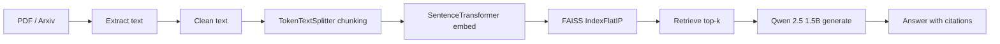

# ResearchChatbot — Local RAG Pipeline with FAISS
A fully local Retrieval-Augmented Generation (RAG) chatbot for research papers. Upload PDFs or scrape papers from Arxiv by keyword, then ask questions — answers are generated by a local LLM with chunk-level citations. Zero API keys required.

## checkout the app : [Chatbot](https://researchchatbot1.streamlit.app/)
### Note : if streamlit app is not working so you can try by uisng smaller model and if it is still not working  then test by clone the repo on you personal device and run the app.py by using command:
```python
pip install -r requirments.txt 
streamlit run app.py
```    
---

## Features

| Feature | Description |
|---|---|
| **Local-first** | No API keys, no cloud services — everything runs on your machine |
| **PDF upload** | Drag-and-drop or browse PDFs via the dashboard sidebar |
| **Arxiv scraper** | Enter a query like "Reinforcement Learning", pick 25–200 papers, click scrape |
| **Chat UI** | Modern Streamlit chatbot with message history, suggestion chips, and source citations |
| **RAG pipeline** | FAISS vector search + `all-MiniLM-L6-v2` embeddings + Qwen 2.5 1.5B LLM |
| **Source citations** | Answers include `[Chunk X]` references with expandable source text |
| **Evaluation harness** | Recall@k, MRR, nDCG@k, Context Precision, Faithfulness, F1, EM |
| **Model caching** | LLM and embedding models are loaded once and reused across queries |

---

## Architecture



Full flowchart: [`RagPipeline/rag_pipeline_flowchart.md`](RagPipeline/rag_pipeline_flowchart.md)

---

## Project structure

```
ResearchChatbot/
├── app.py                              # Streamlit dashboard (main entry point)
├── .gitignore
├── requirements.txt                    # Python dependencies
├── README.md                           # This file
│
├── RagPipeline/
│   ├── rag_pipeline.py                 # Main pipeline orchestrator
│   ├── rag_pipeline_flowchart.md       # Mermaid flowchart + dependency tree
│   └── tools/
│       ├── pdf_extractor.py            # PDF → text (PyMuPDF)
│       ├── text_cleaner.py             # Unicode normalize + regex clean
│       ├── chunking.py                 # TokenTextSplitter chunking
│       ├── create_embeddings.py        # SentenceTransformer embeddings
│       ├── ranker.py                   # FAISS index builder
│       ├── retrieve_top_k.py           # Top-k retrieval
│       └── generator.py               # LLM answer generation (Qwen 2.5)
│
├── document_extractor/
│   ├── pdf_extractor_from_arxiv.py     # Selenium-based Arxiv scraper
│   └── pdf_downloader.py              # urllib PDF downloader
│
├── evaluation/
│   ├── evaluation.py                   # Evaluation harness (CLI)
│   ├── bert_test_questions.json        # 20 test questions with gold answers
│   └── evaluation_results.json         # Output (generated, gitignored)
│
└── docsContainer/                      # Downloaded papers (gitignored)
```

---

## Prerequisites

| Requirement | Details |
|---|---|
| **Python** | 3.10+ |
| **RAM** | 8 GB minimum (16 GB recommended for LLM) |
| **Disk** | 5 GB free (model downloads + papers) |
| **GPU** | Optional — CPU mode works, GPU speeds up generation |
| **Browser** | Chrome (required for Arxiv scraper — Selenium) |
| **OS** | Linux / macOS / WSL2 |

---

## Setup

### 1. Clone and install

```bash
git clone https://github.com/Faizanfarhad/ResearchChatbot.git
cd ResearchChatbot

# Create virtual environment
python -m venv .venv
source .venv/bin/activate   # Linux/macOS
# .venv\Scripts\activate    # Windows

# Install dependencies
pip install -r requirements.txt
```

### 2. Download models (automatic on first run)

The first time you run the app, these models are downloaded from HuggingFace:
- **Embedding:** `sentence-transformers/all-MiniLM-L6-v2` (~90 MB)
- **LLM:** `Qwen/Qwen2.5-1.5B-Instruct` (~3 GB)

Subsequent runs use the cached models (stored at `~/.cache/huggingface/`).

### 3. ChromeDriver (for Arxiv scraping)

The Arxiv scraper uses Selenium with Chrome. Ensure Chrome is installed:

```bash
# Ubuntu/Debian
sudo apt install chromium-chromedriver

# macOS
brew install chromedriver
```

Or install via pip:
```bash
pip install webdriver-manager
```

Then update `pdf_extractor_from_arxiv.py` to use `webdriver_manager.chrome.ChromeDriverManager()` if ChromeDriver isn't in your PATH.

---

## Usage

### Launch the dashboard

```bash
streamlit run app.py
```

Opens at `http://localhost:8501`.

### Upload research papers

1. Click **Upload research papers** in the sidebar
2. Select one or more PDF files
3. Click **Index uploaded papers**
4. Wait for the status to show "Ready — N papers indexed"
5. Start asking questions in the chat

### Scrape papers from Arxiv

1. In the sidebar, type a query like `Reinforcement Learning`
2. Select how many papers to fetch (25, 50, 100, or 200)
3. Click **Scrape & index**
4. Watch the progress as papers are downloaded and indexed
5. Start chatting

### Ask questions

- Type a question in the chat input and press Enter
- Click one of the suggestion chips for quick example questions
- Each answer includes an expandable **source chunks** section showing where the information came from

### Attach files in chat

You can also attach PDFs directly in the chat input:
1. Click the paperclip icon in the chat bar
2. Select a PDF
3. Type your question (or leave blank for "Summarize the attached paper")
4. The file is indexed automatically and appended to existing papers

---

## Evaluation

Run the evaluation harness to measure retrieval and answer quality:

```bash
# Retrieval-only (no LLM — fast):
python evaluation/evaluation.py --doc docsContainer/your-paper.pdf --top_k 10

# With LLM answer generation:
python evaluation/evaluation.py --doc docsContainer/your-paper.pdf --top_k 10 --generate_answer --llm_device cpu

# Full CLI options:
python evaluation/evaluation.py --help
```

### Metrics produced

| Metric | What it measures | Range |
|--------|-----------------|-------|
| **Recall@k** | Fraction of relevant chunks found | [0, 1] |
| **Hit rate** | At least one relevant chunk found | [0, 1] |
| **MRR** | Rank of the first relevant chunk | [0, 1] |
| **nDCG@k** | Ranking quality (position-aware) | [0, 1] |
| **Context precision** | Fraction of top-k that are relevant | [0, 1] |
| **Faithfulness** | Answer grounded in source chunks | [0, 1] |
| **Relevance** | Key concepts from gold answer present | [0, 1] |
| **Token F1** | Word overlap with gold answer | [0, 1] |
| **EM** | Exact string match with gold answer | [0, 1] |

Output saved to: `evaluation/evaluation_results.json`

> **Note:** Answer metrics require `--generate_answer`. Without this flag, only retrieval metrics are computed.

Cost comparison (FAISS vs managed DB) is also included in the output.

---

## Configuration

Key constants in `app.py`:

| Variable | Default | Description |
|----------|---------|-------------|
| `CHUNK_SIZE` | 1024 | Tokens per chunk |
| `CHUNK_OVERLAP` | 200 | Overlap between adjacent chunks |
| `LLM_MODEL_NAME` | `Qwen/Qwen2.5-1.5B-Instruct` | HF model for generation |
| `EMBED_MODEL_NAME` | `sentence-transformers/all-MiniLM-L6-v2` | Embedding model |
| `DEVICE` | `cuda` if available, else `cpu` | Inference device |

Environment variables (for `RagPipelineConnector` CLI usage):

| Variable | Default | Description |
|----------|---------|-------------|
| `RAG_TOP_K` | 5 | Chunks to retrieve per query |
| `RAG_CHUNK_SIZE` | 1024 | Chunk size in tokens |
| `RAG_CHUNK_OVERLAP` | 200 | Overlap between chunks |

---

## How it works

### 1. Document ingestion
- **Uploaded PDFs:** raw bytes → `PyPDF2.PdfReader` → page-by-page text extraction
- **Arxiv PDFs:** Selenium scrapes `arxiv.org/search` → `urllib.urlretrieve` downloads → `PdfReader` extracts
- **Local files:** `PyMuPDF (fitz)` opens the file path → page-by-page text extraction

### 2. Text cleaning
`clean_text()` normalizes unicode, strips control characters, collapses whitespace, and removes non-printable characters using regex.

### 3. Chunking
`TokenTextSplitter` (LlamaIndex) splits text into overlapping chunks. Default: 1024 tokens with 200-token overlap. Each chunk receives metadata: `chunk_id`, `char_count`, `word_count`.

### 4. Embedding
`SentenceTransformer` (`all-MiniLM-L6-v2`, 384 dimensions) encodes all chunks in a single batched call with `normalize_embeddings=True`. Output: `float32` NumPy array of shape `(num_chunks, 384)`.

### 5. FAISS indexing
`faiss.IndexFlatIP` stores L2-normalized embeddings. Inner product between normalized vectors equals cosine similarity. Search is sub-millisecond for up to ~100K chunks.

### 6. Query retrieval
The user question is cleaned, embedded (with normalization), and searched against the FAISS index. Top-k chunks are returned with similarity scores.

### 7. Answer generation
Retrieved chunks are formatted as `[Chunk X] text` blocks. A prompt template instructs Qwen 2.5 to answer using only the context, cite chunks, and say "I don't have enough information" if the answer isn't in the context.

### 8. Model caching
- **Embedding model + FAISS index:** cached via `@st.cache_resource` — rebuilt only when new papers are loaded
- **LLM (Qwen 2.5):** cached via module-level `_model_cache` dict in `generator.py` — downloaded once, reused across all queries

---

## Design decisions

| Decision | Rationale |
|----------|-----------|
| **FAISS over managed DB** | Zero cost, sub-millisecond CPU search, no external services needed |
| **IndexFlatIP with normalized vectors** | Inner product = cosine similarity with normalized vectors; no separate normalization step at search time |
| **all-MiniLM-L6-v2 (384d)** | 90 MB model, fast CPU inference, adequate quality for QA tasks. Half the memory of 768d alternatives. |
| **Qwen 2.5 1.5B** | Small enough for CPU inference (~3 GB), instruction-tuned, good instruction-following for citations |
| **TokenTextSplitter (1024/200)** | Balanced context preservation vs retrieval precision. 512 was too fragmented, 2048 mixed too many topics per chunk. |
| **Chunk-level citations** | [Chunk X] references let users verify answers against source material directly |
| **Streamlit over Gradio** | Modern chatbot UI with `st.chat_message`, built-in file upload, session state, and suggestion chips |

---

## Limitations & future improvements

| Limitation | Potential fix |
|---|---|
| Single document index at a time | Multi-document FAISS with metadata filtering by paper |
| No chat history context for LLM | Pass conversation history in the prompt for multi-turn dialog |
| No PDF image/table extraction | Add `pymupdf` image extraction or table parsing (Camelot/Tabula) |
| Arxiv scraper limited to 200 papers | Paginate through Arxiv results for larger batches |
| No persistent FAISS index | Save/load index with `faiss.write_index()` + pickle metadata |
| All answer metrics = 0 without `--generate_answer` | Default `generate_answer=True` in evaluation or add a lightweight API LLM fallback |
