# RAG Pipeline — System Flowchart

```mermaid
flowchart TD
    START(["🚀 START"]) --> MODE{"Input source?"}

    %% ── Path 1: Uploaded PDF / Arxiv ──
    MODE -->|"Uploaded PDF"| PDF_RAW["📄 Raw PDF bytes<br/>(st.file_uploader)"]
    MODE -->|"Arxiv scrape"| ARXIV["🔍 Arxiv search<br/>(ExtractPdf class)"]
    MODE -->|"Local file"| LOCAL["📁 Local PDF path<br/>(RagPipelineConnector)"]

    PDF_RAW --> PDF_READER["PyPDF2.PdfReader<br/>page-by-page extraction"]
    LOCAL --> FITZ["PyMuPDF (fitz)<br/>extract_texts()"]

    ARXIV --> SCRAPE["Selenium ChromeDriver<br/>scrapes arxiv.org"]
    SCRAPE --> URLs["PDF URLs + titles + authors"]
    URLs --> DOWNLOAD["urllib.urlretrieve()<br/>download each PDF"]
    DOWNLOAD --> PDF_READER

    FITZ --> CLEAN["🧹 clean_text()<br/>(unicode normalize, regex clean)"]
    PDF_READER --> CLEAN

    CLEAN --> RAW_TEXT["📝 Raw clean text<br/>(single string)"]

    %% ── Chunking ──
    RAW_TEXT --> DOC_OBJ["LlamaIndex Document<br/>(text + metadata)"]
    DOC_OBJ --> SPLITTER["TokenTextSplitter<br/>chunk_size + overlap"]
    SPLITTER --> CHUNKS["✂️ TextNode chunks<br/>metadata: chunk_id, char_count, word_count"]

    %% ── Embedding ──
    CHUNKS --> EMBED["SentenceTransformer.encode()<br/>all-MiniLM-L6-v2 (384d)<br/>normalize_embeddings=True"]
    EMBED --> EMBED_STACK["np.array (float32)<br/>shape: (num_chunks, 384)"]

    %% ── FAISS Index ──
    EMBED_STACK --> FAISS["build_faiss_index()<br/>IndexFlatIP (cosine similarity)"]
    FAISS --> INDEX_READY["📥 FAISS index ready"]

    %% ── Query ──
    INDEX_READY --> USER_Q["❓ User question<br/>(st.chat_input)"]
    USER_Q --> Q_CLEAN["🧹 clean_text(question)<br/>normalize + validate"]
    Q_CLEAN --> Q_EMBED["embedding_model.encode()<br/>+ normalize_embeddings=True"]
    Q_EMBED --> SEARCH["faiss_index.search(top_k)<br/>inner product → cosine scores"]
    SEARCH --> RETRIEVED["📋 Top-k retrieved chunks<br/>(rank, score, chunk_id, text)"]

    %% ── Generation ──
    RETRIEVED --> GEN_CHECK{"generate_answer?"}
    GEN_CHECK -->|"No"| ANSWER_EMPTY["answer = ''<br/>(retrieval-only mode)"]
    GEN_CHECK -->|"Yes"| FORMAT["_format_context()<br/>[Chunk X] text blocks"]
    FORMAT --> PROMPT["Prompt template:<br/>Context + Question + Instructions"]

    %% ── 4-bit Quantization Flow ──
    PROMPT --> QUANT_CHECK{"Model in<br/>_model_cache?"}
    QUANT_CHECK -->|"No (first call)"| BNB_CONFIG["BitsAndBytesConfig<br/>load_in_4bit=True<br/>bnb_4bit_compute_dtype=float16"]
    BNB_CONFIG --> DOWNLOAD["AutoModelForCausalLM<br/>.from_pretrained()<br/>+ quantization_config"]
    DOWNLOAD --> EVAL_MODE_SET["model.eval()"]
    EVAL_MODE_SET --> STORE["Store in _model_cache<br/>key=(model_name, device)"]

    QUANT_CHECK -->|"Yes (cached)"| REUSE["Reuse cached<br/>tokenizer + 4-bit model"]

    STORE --> TOKENIZE
    REUSE --> TOKENIZE["tokenizer(prompt_text)<br/>return_tensors='pt' → device"]

    TOKENIZE --> GENERATE["model.generate()<br/>max_new_tokens, temp=0.7<br/>top_p=0.9, torch.no_grad()"]
    GENERATE --> DECODE["tokenizer.decode()<br/>skip_special_tokens=True"]
    DECODE --> STRIP["Strip prompt from output<br/>response[len(prompt):]"]
    STRIP --> ANSWER["✅ Generated answer<br/>with [Chunk X] citations"]

    ANSWER_EMPTY --> RETURN["Return dict:<br/>question, answer, source_chunks, total_sources"]
    ANSWER --> RETURN

    %% ── Evaluation ──
    RETURN --> EVAL_MODE{"Evaluation mode?"}
    EVAL_MODE -->|"Yes"| EVAL["evaluation.py<br/>Reads bert_test_questions.json"]
    EVAL --> EVAL_RET["Recall@k, Hit Rate, MRR, nDCG@k<br/>Context Precision"]
    EVAL --> EVAL_ANS["Faithfulness, Relevance<br/>EM, Token F1"]
    EVAL_RET --> EVAL_OUT["📊 evaluation_results.json"]
    EVAL_ANS --> EVAL_OUT

    EVAL_MODE -->|"No"| STREAMLIT["🎨 Streamlit Dashboard<br/>st.chat_message() bubbles"]

    %% ── Styling ──
    style START fill:#4CAF50,color:#fff
    style ANSWER fill:#4CAF50,color:#fff
    style INDEX_READY fill:#9C27B0,color:#fff
    style RETRIEVED fill:#00BCD4,color:#fff
    style CHUNKS fill:#FF9800,color:#fff
    style RAW_TEXT fill:#FF9800,color:#fff
    style STREAMLIT fill:#E91E63,color:#fff
    style EVAL_OUT fill:#2196F3,color:#fff
    style BNB_CONFIG fill:#FF5722,color:#fff
    style DOWNLOAD fill:#FF5722,color:#fff
    style STORE fill:#607D8B,color:#fff
    style REUSE fill:#607D8B,color:#fff
```



## 4-bit Quantization Detail

The generator uses **NF4 (NormalFloat4)** quantization via `BitsAndBytesConfig`:

```
Full model (~3 GB float16)
        │
        ▼
BitsAndBytesConfig(load_in_4bit=True)
        │
        ▼
4-bit quantized model (~0.75 GB)
        │
        ▼
_model_cache[(model_name, device)] ← stored once, reused forever
```

| Aspect | Without quantization | With 4-bit NF4 |
|--------|---------------------|----------------|
| Memory (Qwen 2.5 1.5B) | ~3 GB (float16) | ~0.75 GB (4-bit) |
| Inference speed | Fast (native dtype) | Slightly slower (dequant on-the-fly) |
| Quality loss | None | Minimal (<1% perplexity increase) |
| Deployable on Render free? | ❌ OOM | ⚠️ Tight but possible |

## Component dependency tree

```
app.py (Streamlit Dashboard)
├── RagPipeline/rag_pipeline.py (RagPipelineConnector)
│   ├── RagPipeline/tools/pdf_extractor.py (ExtractPdfContent)
│   │   └── RagPipeline/tools/text_cleaner.py (clean_text)
│   ├── RagPipeline/tools/chunking.py (CreateChunking)
│   │   └── llama_index.core.node_parser.TokenTextSplitter
│   ├── RagPipeline/tools/create_embeddings.py (create_embedding)
│   │   └── sentence_transformers.SentenceTransformer
│   ├── RagPipeline/tools/ranker.py (build_faiss_index)
│   │   └── faiss.IndexFlatIP
│   ├── RagPipeline/tools/retrieve_top_k.py (retrieve_top_k)
│   └── RagPipeline/tools/generator.py (create_generator)
│       ├── transformers.AutoModelForCausalLM (Qwen2.5-1.5B)
│       ├── transformers.BitsAndBytesConfig (4-bit NF4 quantization)
│       └── RagPipeline/tools/text_cleaner.py (clean_text)
├── document_extractor/pdf_extractor_from_arxiv.py (ExtractPdf)
│   └── selenium + urllib
└── document_extractor/pdf_downloader.py (download_pdf)

evaluation/evaluation.py (Eval harness)
└── RagPipeline.rag_pipeline.RagPipelineConnector
```

## Data flow summary

| Step | Input | Output | Tool |
|------|-------|--------|------|
| 1. Ingest | PDF bytes / path / URL | Raw clean text | `ExtractPdfContent` / `PdfReader` |
| 2. Clean | Raw text | Normalized text | `clean_text()` |
| 3. Chunk | Clean text | List of TextNode (chunk_id, text, metadata) | `TokenTextSplitter` |
| 4. Embed | TextNode list | float32 np.array (N, 384) | `SentenceTransformer` |
| 5. Index | Embedding matrix | FAISS IndexFlatIP | `faiss` |
| 6. Retrieve | User question | Top-k chunks (rank, score, text) | `faiss_index.search()` |
| 7a. Quantize | Full-precision weights | 4-bit NF4 weights (~75% smaller) | `BitsAndBytesConfig(load_in_4bit=True)` |
| 7b. Load/Cache | Model ID + device | Tokenizer + quantized model | `_load_model()` with `_model_cache` |
| 7c. Generate | Question + retrieved chunks | Answer with [Chunk X] citations | `Qwen2.5-1.5B-Instruct` (4-bit) |
| 8. Evaluate | 20 test questions | Retrieval + answer metrics JSON | `evaluation.py` |